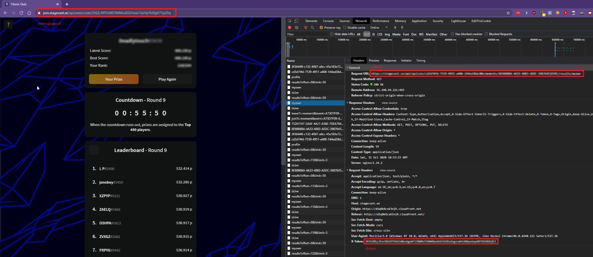

# Benz-Bot

Benz-Bot is a bot to complete the Worlds Quiz 2020 sponsored by Mercedes.

## Installation

Use the package manager to install dependencies:

```bash
pip install selenium
pip install requests
```
After that, open the starting webpage and press `F12` to open the developer console.
Now, copy the variables shown in this picture  
and paste them into `mercedes.py`.
You are now good to go!

## Usage

Start up the program and enjoy!

## Contributing
Pull requests are welcome. For major changes, please open an issue first to discuss what you would like to change.
